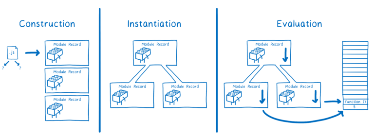

# 模块化

- 概念
  - 最终目的就是将程序分成一个个小的结构
  - 在这个结构中编写属于自己的代码（即有着自己的作用域），定义变量名词时不会因为和其他文件重复而进行污染等
  - 同时可以将自己希望暴露的变量、函数、对象等导出给其他结构/块使用
  - 也可以通过导入其他结构中的变量、函数、对象等
- 此类结构即成为模块，用于对程序代码进行划分切割

## 模块化方案(规范)

- CommonJS(ES5)
- ES Module(ES6 之后)
- AMD 和 CMD(社区兴起过一段时间)

### CommonJS

#### CommonJS 是一个规范，最初提出是在浏览器以外的地方使用，并被命名为 ServerJS，后来改名为 CommonJS

- Node 是 CommonJS 在服务器端一个具有代表性的实现
- Browserify 是 CommonJS 在浏览器中的一种实现
- webpack 具备对 CommonJS 的支持和转换

#### 使用

- 导出内容(模块)：exports,但主要方式还是 module.exports
  - 但其实 CommonJS 中并没有 module.exports 的概念,这是借助于 node 全局对象下的 Module 类实现的
- 导入内容(模块)：require

foo.js

```js
var name = 'oor'
exports.name = name
```

bar.js

```js
var foo = require('foo.js')

console.log(foo.name) // oor
```

#### 导入导出的本质

- exports 是一个对象

  ```js
  var name = 'oor'
  exports.name = name //
  ```

- require 本质是引用赋值

  ```js
  var foo = require('foo.js') // 将foo.js中exports对象的内存地址赋值到bar.js中的foo变量
  ```

#### CommonJS 规范缺点

- CommonJS 加载模块是同步的:
  - 意味着只有等到对应的模块加载完毕,当前模块中的内容才能被运行
  - 因为服务器加载 js 文件都是本地文件,加载非常快,所以在 node 开发服务器这样的环境下,影响不大,但是在浏览器这样需要渲染,更需要异步执行脚本 js 文件情况下(尤其是在页面渲染放在 JS 文件中的前后端分离模式下)十分影响页面渲染
- 应用于浏览器时
  - 浏览器加载 js 文件需要先从服务器将文件下载下来,再加载运行
  - 采用同步意味着后续 js 代码都会被阻塞无法正常运行,即使是一些 DOM 操作也一样
- 所以浏览器环境下一般不使用 CommonJS 规范,而是使用 ES Module
  - 但 webpack 下使用 CommonJS 另当别论
  - 因为 webpack 会有特定 loader 将其转换为浏览器可执行的代码

### ES Module

#### ES Module 使用

- 导出内容(模块)：exports
- 导入内容(模块)：import
- 另外:采用 ES Module 将自动采用严格模式:"use strict"

#### 和 CommonJS 的不同

- 一方面 ES Module 使用的关键字不同
- 另一方面采用编译期的静态分析,并且也加入了动态引用的方式

#### ES Module 的解析流程

- ES Module 的解析过程可以划分为三个阶段：
  - 阶段一：构建（Construction），根据地址查找 js 文件，并且下载，将其解析成模块记录（Module Record）
  - 阶段二：实例化（Instantiation），对模块记录进行实例化，并且分配内存空间，解析模块的导入和导出语句，把模块指向
    对应的内存地址
  - 阶段三：运行（Evaluation），运行代码，计算值，并且将值填充到内存地址中
    
